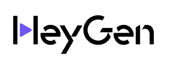

# Heygen MCP Server



The HeyGen MCP server enables any MCP Client like Claude Desktop or Agents to use the [HeyGen API](https://docs.heygen.com/) to generate avatars and videos.

[](https://opensource.org/licenses/MIT)

Note: This project is in early development. While we welcome community feedback and contributions, please be aware that official support is limited.

## Installation

### Prerequisites

- Python 3.10 or higher
- A Heygen API key (get one from [Heygen](https://www.heygen.com/)). Includes 10 Free Credits per Month

### Installing uv

uv is a fast Python package installer and resolver that we recommend for installing this package.

**macOS or Linux:**

```bash
# Install with the official installer script
curl -LsSf https://astral.sh/uv/install.sh | sh

# Or via Homebrew (macOS)
brew install uv
```

**Windows:**

```powershell
# Install with the official installer script in PowerShell
irm https://astral.sh/uv/install.ps1 | iex

# Or via Scoop
scoop install uv
```

For other installation methods, see the [uv documentation](https://github.com/astral-sh/uv).

## Usage

### Quickstart with Claude Desktop

1. Get your API key from [HeyGen](https://www.heygen.com/).
2. Install uv package manager (see [Installing uv](#installing-uv) section above).
3. Go to Claude > Settings > Developer > Edit Config > `claude_desktop_config.json` to include the following:

```json
{
  "mcpServers": {
    "HeyGen": {
      "command": "uvx",
      "args": ["heygen-mcp"],
      "env": {
        "HEYGEN_API_KEY": "<insert-your-api-key-here>"
      }
    }
  }
}
```

If you're using Windows, you'll need to enable "Developer Mode" in Claude Desktop to use the MCP server. Click "Help" in the hamburger menu at the top left and select "Enable Developer Mode".

### Available MCP Tools

The server provides the following tools to Claude:

- **get_remaining_credits**: Retrieves the remaining credits in your Heygen account.
- **get_voices**: Retrieves a list of available voices from the Heygen API (limited to first 100 voices).
- **get_avatar_groups**: Retrieves a list of Heygen avatar groups.
- **get_avatars_in_avatar_group**: Retrieves a list of avatars in a specific Heygen avatar group.
- **generate_avatar_video**: Generates a new avatar video with the specified avatar, text, and voice.
- **get_avatar_video_status**: Retrieves the status of a video generated via the Heygen API.

## Development

### Running with MCP Inspector

To run the server locally with the MCP Inspector for testing and debugging:

```bash
uv --with "mcp[cli]" dev heygen_mcp/server.py
```

This will start the server in development mode and allow you to use the MCP Inspector to test the available tools and functionality.

## Roadmap

- [ ] Tests
- [ ] CICD
- [ ] Photo Avatar APIs Support
- [ ] SSE And Remote MCP Server with OAuth Flow
- [ ] Translation API Support
- [ ] Template API Support
- [ ] Interactive Avatar API Support

## Contributing

Contributions are welcome! Please feel free to submit a Pull Request.

## License

This project is licensed under the MIT License - see the LICENSE file for details.
